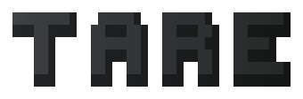

<div align="center">
  <picture>
    <source media="(prefers-color-scheme: dark)" srcset=".github/logo-dark.svg">
    <source media="(prefers-color-scheme: light)" srcset=".github/logo-light.svg">
    
  </picture>

  <p>Prove your coding agent starts with nothing of yours before you measure it.</p>
</div>

<div align="center">

[![License: MIT][license-shield]][license-url]
[![Version 0.1.0][version-shield]][version-url]
[![Python 3.11+][python-shield]][python-url]
[![Linux | WSL][platform-shield]][platform-url]
[![Claude Code | Codex | Pi][agent-shield]][agent-url]

</div>

<div align="center">
  <a href="#quick-start">Quick Start</a> &middot;
  <a href="#features">Features</a> &middot;
  <a href="#how-it-works">How it works</a> &middot;
  <a href="CONCEPT.md">Concept</a> &middot;
  <a href="https://github.com/AndreRatzenberger/tare/issues/new?template=bug_report.md">Report Bug</a>
</div>

<br>

---

## Why tare?

Skill and agent evaluations compare runs with a skill against runs without it. If your agent
brings your own instructions, memory, skills or connected accounts into both runs, the
comparison measures your machine, not the skill. Moving the config directory is not enough:
with Claude Code, the login alone brings your connectors (mail, calendar, documents), your
account's skills and your email into the session. Eval frameworks assume that you provide a
clean runtime, and nothing checks that you did.

If you run skill evals, A/B comparisons or agent benchmarks with Claude Code, Codex or Pi on
your own machine, tare is for you.

## Features

- **Proves the room before the run.** You get `tare: 0.00`, or every leak with its source,
  and the agent does not start until the reading is zero.
- **Measures instead of asking.** tare checks what the agent actually receives. An agent asked
  about its own context can refuse or be wrong.
- **Tells you when it cannot see.** Every probe also checks your real setup. If tare cannot
  find a kind of context there, it tries once more (a busy machine can be slow to connect MCP
  servers) and then reports itself blind instead of reporting clean.
- **Puts nothing of yours within reach.** Your home directory, your other logins and your
  shell's secrets do not exist inside the room.
- **Keeps your own session logged in.** Each run gets a fresh copy of the login, removed
  afterwards. tare refuses to start when that copy would have to refresh, because a refresh
  could log out your real session.
- **Works like the agent you know.** Claude Code, Codex or Pi, interactive or one-shot: all of
  the agent's arguments pass through, and your project is mounted at `/work`.
- **Compares skills, plugins or models in one call.** `tare calibrate` runs every side from
  fresh starts in rooms of their own, each with its own prompt if it needs one, and reports pass
  rates with intervals, judge scores, or, without a check, the kept workspaces for your scoring.
- **Tells whether the room or the model lost it.** `tare swap` runs two agents on the same
  task (Claude Code against Codex, or two models) and lets each continue the other's work
  at several points. You see whether a run failed because of what its workspace had become
  or because of the agent continuing it.
- **Shows where a failed run became lost** (experimental). `tare cliff` resumes a failed run
  from its own steps, many times, and names the step after which it no longer succeeds as
  often as a fresh start does, with the evidence next to it.

## When to use

| Use tare when | Look elsewhere when |
|---|---|
| you compare agent runs with and without a skill, plugin or prompt | you need a sandbox against a hostile agent: the room has network access and a usable login |
| you benchmark agents on your own machine | you are on macOS (planned, not built) |
| you want a fresh-machine run without a fresh machine | you log in with an API key only (untested) |
| an agent failed a task and you want to know which step lost it | you want a single run explained without rerunning it: Cliff spends tails |

## Quick Start

```bash
git clone https://github.com/AndreRatzenberger/tare.git && cd tare
uv run tare probe claude
```

```text
tare probe · claude 2.1.289 · /home/me/tare
  control   dirty twin shows: instructions, home path, mcp, skills, plugins, email, reach
  leaks     none
  declared
    email        account email                                subscription login
    credentials  /home/tare/.claude-config/.credentials.json  copy of the login, needed by the CLI
tare: 0.00
```

This is the output of a real run, with only the home path shortened. Then
`uv run tare claude` starts Claude Code in that room; `uv run tare probe codex` and
`uv run tare codex` do the same for Codex.

## Install

| Requirement | Notes |
|---|---|
| Linux or WSL2 | the room is built with user namespaces |
| [bubblewrap](https://github.com/containers/bubblewrap) | `sudo apt install bubblewrap` |
| Claude Code, Codex or Pi | on `PATH`, logged in; Codex installed under `/usr` (`npm install -g @openai/codex`) |
| [uv](https://docs.astral.sh/uv/) | Python 3.11+ |

From a checkout, either run it in place (`uv run tare ...`) or put `tare` on your `PATH`:

```bash
uv tool install .
```

## Usage

```bash
tare probe claude                  # measure the room: tare: 0.00, or every leak and its source
tare claude                        # probe, then start Claude Code in the room
tare claude -- -p "fix the tests"  # arguments after -- go to claude
tare claude --yolo                 # adds --dangerously-skip-permissions
tare claude --allow-dirty          # start even though the reading is not zero
tare claude --project ../other     # another project directory (default: the current one)

tare probe codex                   # the same for Codex
tare probe pi                      # and for Pi
tare codex -- exec -m MODEL "..."  # one-shot Codex run; arguments after -- go to codex
```

The room starts with the agent's defaults, not your settings: Codex runs its default model
unless you pass `-m`. Set the model explicitly when you compare runs.

A room that is not clean names each leak and where it came from. This is an excerpt of a real
run in a room with planted dirt, with the home path shortened:

```text
  leaks
    instructions global instructions     /home/me/.claude/CLAUDE.md
    home path    /home/me/               the user's files
    skills       1 skill                 /home/me/.claude/skills
    env          SPIKE_API_KEY           inherited environment
tare: 4 leaks
```

Two residuals are declared: they appear in the reading but do not block the run. With a
subscription login, your account email arrives with the login. The room also holds a copy of
your login, because the agent needs one to run.

### Cliff: where did a failed run become lost

> **Experimental.** Cliff finds a known cliff in a scripted run, and on real runs it has not
> raised a false alarm. But it has not yet found a cliff in a real run: neither real round had
> a failure that sat in one step ([migration](experiments/migration/RESULTS.md),
> [HTML](experiments/html/RESULTS.md)). Swap's cells where an agent continues its own room
> are a coarse Cliff at three cuts; when they drop between two cuts, Cliff can zoom in.

```bash
tare cliff claude "fix the failing test" --check "uv run pytest -q" -- --model sonnet
```

tare runs the task once in a room and keeps a snapshot of the workspace and the conversation
after every tool call. If the check fails, it resumes the run from those steps in fresh
rooms, three tails at a time. A fresh start is the baseline. The search narrows down the step
after which the tails stop passing, until the evidence separates or the budget (`--budget`,
default 30 tails) is spent. Everything after `--` goes to every agent run, so pin the model.

This report comes from the real machinery (Claude Code, rooms, resume, check) run against a
scripted model whose cliff is known: step 4 writes the wrong answer into a note.

```text
  step  what the step did                                      tails  pass  rate  95% interval
     0  start                                                     3     3  1.00  0.44-1.00
     3  Bash echo hi > scratch.txt                                6     5  0.83  0.44-0.97
     4  Bash echo answer=41 > notes.txt                           6     0  0.00  0.00-0.39 <
     6  Bash echo 41 > answer.txt                                 3     0  0.00  0.00-0.56

  verdict   The run became lost at step 4.
  at step 4: Bash echo answer=41 > notes.txt
  changed   notes.txt
  monotone  yes
  tails     18 of a budget of 30
```

Cliff works with Claude Code, Codex and Pi (`tare cliff pi ...`). All three resume their own
sessions natively; an agent that cannot is continued by handoff. Each tail is a real agent
run, so a search costs what its tails cost.

### Calibrate first

```bash
tare calibrate "fix the failing test" --check "uv run pytest -q" \
  --side "claude --model haiku" --side "codex -m gpt-6.1-sol" --runs 10
```

Before Cliff or Swap spend tails on a task, calibrate tells you how often each side passes
it from a fresh start, with intervals. Cliff and Swap need a task where the original fails but
a fresh start sometimes passes, or where one side mostly fails and the other mostly passes.
With a judge check at threshold 0, every run passes and the scores are what count: the report
lists them per side and the dashboard draws them on a 0-100 scale. `--keep` keeps every
finished workspace, for `judge-noise`.
Cliff now declares a model gap only when the baseline's upper bound is below `--gap-below`
(default 0.2), so 0 of 3 is no longer read as "never".

Two skills that are invoked differently compare in one call: `--side-prompt` gives a side
(a, b, c… in `--side` order) its own prompt. Without `--check`, every run that ends counts,
its workspace is kept, and the report shows the finished runs and their times, for scoring
elsewhere.

```bash
tare calibrate --side "claude --plugin-dir plugins/a" --side "claude --plugin-dir plugins/b" \
  --side-prompt "a=/a:ideate a todo app" --side-prompt "b=/b:ideate a todo app" --runs 5
```

### Judge: when tests cannot decide

```bash
tare judge-noise good-page/ bad-page/ --rubric rubric.md --times 10 --threshold 60
tare cliff claude "build the page" --check "tare judge --rubric $PWD/rubric.md --threshold 60" -- --model haiku
```

For work like a web page, a judge model scores the result. tare renders the page headless in a
room of its own and gives a judge agent the screenshot, the source and your rubric, in a fresh,
blind room: no agent or model names. `tare judge` is a check (exit 0 at or above the threshold);
its score line shows up in the dashboard. A judge has its own noise: one test page scored 55, 60,
58, 58, 66 and 62 on six runs. So `tare judge-noise` scores the same pages repeatedly and refuses a
threshold that falls inside a page's spread.

### Watch it live, repeat it exactly

`tare cliff` and `tare swap` start a live dashboard and print its URL
(`http://localhost:8777/`). It shows the recipe, the probes, the original runs step by step,
every tail as it starts and ends with what its agent is doing right now, the Cliff chart or
the Swap matrix filling in, and the report.

```bash
tare watch ~/.local/state/tare/cliff/myproject-20261005-142000   # any run, live or finished
tare watch ~/.local/state/tare/calibrate/*                         # several runs: one row each
tare rerun ~/.local/state/tare/cliff/myproject-20261005-142000   # the same run again
```

Every run directory holds a `recipe.json`: the command, task and check, a digest of the
project, the agents with their CLI versions and arguments, and the parameters. `tare rerun`
repeats the run in a new directory and says what has changed since.

### Swap: the room or the model

```bash
tare swap "fix the failing test" --check "uv run pytest -q" --a claude --a-args "--model sonnet" --b codex
```

Both agents run the task once in a room. At each cut (`--cuts`, default `0,0.5,1`) every
agent continues every room, three tails each, from the same handoff: the workspace plus a
neutral account of the steps so far, rendered the same way for every agent. The *state
effect* says how much better the tails do in room a than in room b. The *model effect* says
how much better agent a does than agent b. At cut 0 both rooms are your untouched project,
so the state effect there must be zero: that is the null check. Where an agent can resume its
own session (Claude Code and Codex), a native cell prices what the handoff itself costs.

This report comes from the real machinery against two scripted models whose truth is
known: a is competent but trusts a note in the workspace, b is weak, and run b poisoned
the note at step 2.

```text
  cut 0.00: room a at step 0, room b at step 0
                agent a          agent b
    room a      4/4 0.51-1.00    1/4 0.05-0.70
    room b      4/4 0.51-1.00    1/4 0.05-0.70
    state effect  +0.00 [-0.35, +0.35]  (room a better than room b)
    model effect  +0.75 [+0.28, +0.89]  (agent a better than agent b)

  cut 0.50: room a at step 2, room b at step 2
                agent a          agent b
    room a      4/4 0.51-1.00    1/4 0.05-0.70
    room b      0/4 0.00-0.49    2/4 0.15-0.85
    state effect  +0.38 [-0.03, +0.66]  (room a better than room b)
    model effect  +0.12 [-0.25, +0.44]  (agent a better than agent b)

  null check   passed: no state effect at cut 0, where both rooms are the untouched project
  verdict      blame passes from the model to the room between cut 0.00 and cut 0.50; some
               deciding intervals still include zero, more tails would firm this up
```

## How it works

tare takes three readings, and none of them asks the agent anything. First, the real CLI runs
inside the room against a local fake model endpoint, which keeps the request it receives: that
request is the context the agent was given. Second, the same run in your real setup is the
control, so tare knows it can see your context at all. Third, a plain script inside the room
looks for your files and inherited secrets.

→ [Concept, the three layers and the measurements behind them](CONCEPT.md)
→ [The dirty-twin experiments that decided the probe design: Claude Code](experiments/dirty-twin/RESULTS.md), [Codex](experiments/dirty-twin-codex/RESULTS.md)

## Roadmap

Next: [Gemini CLI][epic-gemini], with its own dirty-twin measurement, room and probe. A room
for macOS is an idea, not yet planned.

[epic-gemini]: https://github.com/AndreRatzenberger/tare/issues/34

## Contributing

Work is organised as epics with features; each epic is one branch and one PR. The process,
the checks and the conventions are in [AGENTS.md](AGENTS.md). Run the tests with
`uv run pytest`.

## License

MIT. See [LICENSE](LICENSE).

---

Crafted with [Readme Craft](https://github.com/motiful/readme-craft)

[license-shield]: https://img.shields.io/badge/license-MIT-blue.svg
[license-url]: LICENSE
[version-shield]: https://img.shields.io/badge/version-0.1.0-informational.svg
[version-url]: pyproject.toml
[python-shield]: https://img.shields.io/badge/python-3.11%2B-3776AB.svg
[python-url]: https://www.python.org/
[platform-shield]: https://img.shields.io/badge/platform-Linux%20%7C%20WSL-555555.svg
[platform-url]: #install
[agent-shield]: https://img.shields.io/badge/agents-Claude%20Code%20%7C%20Codex%20%7C%20Pi-D97757.svg
[agent-url]: #install
